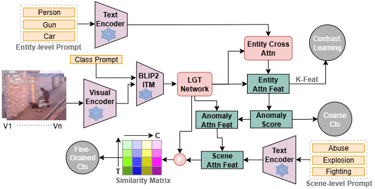

# MLPVAD
This is the official Pytorch implementation of our paper:
**"MLPVAD: Video Anomaly Detection Using Multi-level Text Prompts and Context-Aware Frame Sampling for Long Duration Videos"** in **AAAI 2026.**  



## Highlight
- We propose a novel VAD framework that emulates human cognitive processes, featuring a context-aware frame sampling (CAFS) module optimized for long-duration videos by leveraging large language models (LLMs). To our knowledge, **MLPVAD is the first work to use pre-trained language-visual model for task-aware frame selection from long videos**.

- We introduce Multi-level Text Prompt Guided Network enhancing contextual understanding at both entity and scene levels, supported by contrastive learning for discriminative coarse- and fine-grained classification. To our knowledge, **MLPVAD is the first work to efficiently use multilevel text-prompt for long duration WSVAD**.

- We show that strength and effectiveness of MLPVAD on two large-scale popular benchmarks, and MLPVAD achieves state-of-the-art performance, e.g., it gets unprecedented results of 88.82\% AUC and 85.37\% AP on UCF-Crime and XD-Violence respectively, surpassing current classification based methods by a large margin.

## Training

### Setup
To install the repository. Follow the below steps:

```bash
git clone https://github.com/vlm-researcher/MLPVAD.git
cd MLPVAD/LAVIS
pip install -e .
```

The following files need to be adapted in order to run the code on your own machine:
- Change the file paths to the download datasets above in `list/*_CLIP_rgb.csv` and `list/*_CLIP_rgbtest.csv`. 
- Feel free to change the hyperparameters in `ucf_option.py` and  `xd_option.py`
### Train and Test
After the setup, use CLIP visual encoder (ViT16/ViT14) and extract the visual feature. Or, use extracted features provided by [VadCLIP](https://github.com/nwpu-zxr/VadCLIP) repository. 
Next, simply run the following command: 

Training and infer for UCF-Crime dataset
```
python ucf_train.py
python ucf_test.py
```

Training and infer for XD-Violence dataset
```
python xd_train.py
python xd_test.py
```

## References
We referenced the repos below for the code.
* [LAVIS](https://github.com/salesforce/LAVIS)
* [VadCLIP](https://github.com/nwpu-zxr/VadCLIP)

## Citation

If you find this repo useful for your research, please consider citing our paper:


```
---
